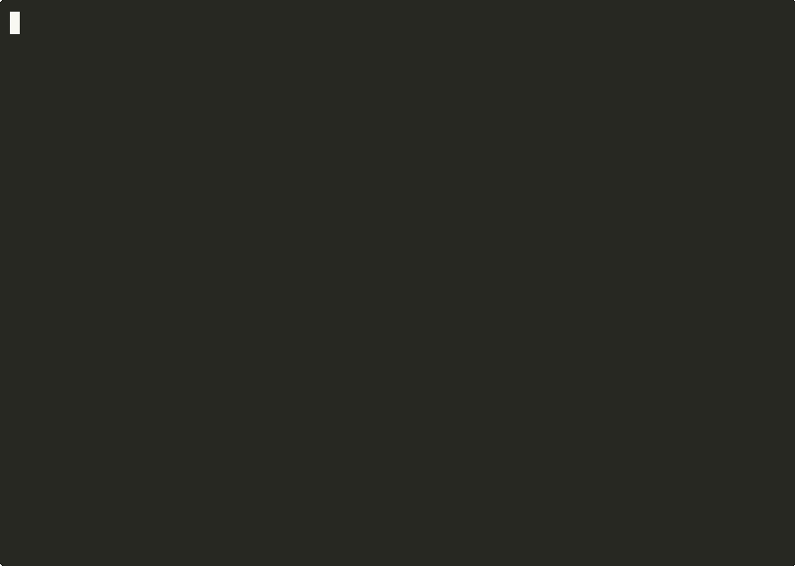

## Starknet Foundry

[![Telegram Chat][tg-badge]][tg-url] [![Telegram Support][tg-support-badge]][tg-support-url]

[tg-badge]: https://img.shields.io/endpoint?color=neon&logo=telegram&label=chat&style=flat-square&url=https%3A%2F%2Ftg.sumanjay.workers.dev%2Fstarknet_foundry

[tg-url]: https://t.me/starknet_foundry

[tg-support-badge]: https://img.shields.io/endpoint?color=neon&logo=telegram&label=support&style=flat-square&url=https%3A%2F%2Ftg.sumanjay.workers.dev%2Fstarknet_foundry_support

[tg-support-url]: https://t.me/starknet_foundry_support


Blazingly fast toolkit for developing Starknet contracts designed & developed by
ex [Protostar](https://github.com/software-mansion/protostar) team from [Software Mansion](https://swmansion.com) based
on native [Cairo](https://github.com/starkware-libs/cairo) test runner
and [Blockifier](https://github.com/starkware-libs/blockifier), written in Rust 🦀.

Need help getting started with Starknet Foundry? Read the
📖 [Starknet Foundry Book](https://foundry-rs.github.io/starknet-foundry/)!



Starknet Foundry, like its [Ethereum counterpart](https://github.com/foundry-rs/foundry), consists of different modules

- [`snforge`](https://github.com/foundry-rs/starknet-foundry/tree/master/crates/forge): Starknet testing
  framework (like Truffle, Hardhat and DappTools but for Starknet).
- [`sncast`](https://github.com/foundry-rs/starknet-foundry/tree/master/crates/sncast): All-in-one tool for
  interacting with Starknet smart contracts, sending transactions and getting chain data.

## Installation

[Follow the installation manual](https://foundry-rs.github.io/starknet-foundry/getting-started/installation.html)

## FAQ

> Why do I have to install Rust?

`snforge` relies on Scarb's [_procedural macros_](https://github.com/foundry-rs/starknet-foundry/issues/2299) to create
`snforge_scarb_plugin` which is a part of `snforge_std`.
This plugin is required for `snforge` test to work.
Currently, _procedural macros_ require Rust installation to function.
This will be changed in the upcoming versions of Scarb.

> Why `scarb test` isn't running my tests correctly?

By default, `scarb test` doesn't use `snforge` to run tests, and it needs to be configured.
Make sure to include this section in `Scarb.toml`

```toml
[scripts]
test = "snforge test"
```

## Roadmap

Starknet Foundry is under active development! Expect a lot of new features to appear soon! 🔥

- [x] Running tests written in Cairo
- [x] Contract interactions testing
- [x] Interacting with Starknet from command line
- [x] Multicall support
- [x] Cheatcodes
- [x] Starknet state forking
- [x] Fuzz testing
- [x] Parallel tests execution
- [x] Performance improvements
- [x] Deployment scripts written in Cairo
- [ ] Transactions profiling 🏗️
- [ ] Debugging utilities 🏗️
- [ ] Test coverage reports (check out [cairo-coverage](https://github.com/software-mansion/cairo-coverage)) 🏗️
- [ ] L1 ↔ L2 messaging and cross-chain testing

## Performance


`snforge` achieves performance comparable to the Cairo Test Runner with improved user experience.

## Getting Help

You haven't found your answer to your question in
the [Starknet Foundry Book](https://foundry-rs.github.io/starknet-foundry/)?

- Join the [Telegram](https://t.me/starknet_foundry_support) group to get help
- Open a [GitHub discussion](https://github.com/foundry-rs/starknet-foundry/discussions) with your question
- Join the [Starknet Discord](https://discord.com/invite/starknet-community)

Found a bug? Open an [issue](https://github.com/foundry-rs/starknet-foundry/issues).

## Contributions

Starknet Foundry is under active development, and we appreciate any help from the community! Want to contribute? Read
the [contribution guidelines](./CONTRIBUTING.md).

Check out [development guide](https://foundry-rs.github.io/starknet-foundry/development/environment-setup.html) for
local environment setup guide.
