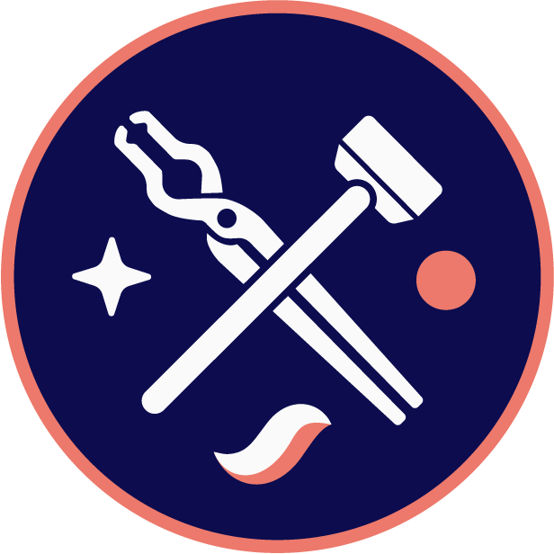
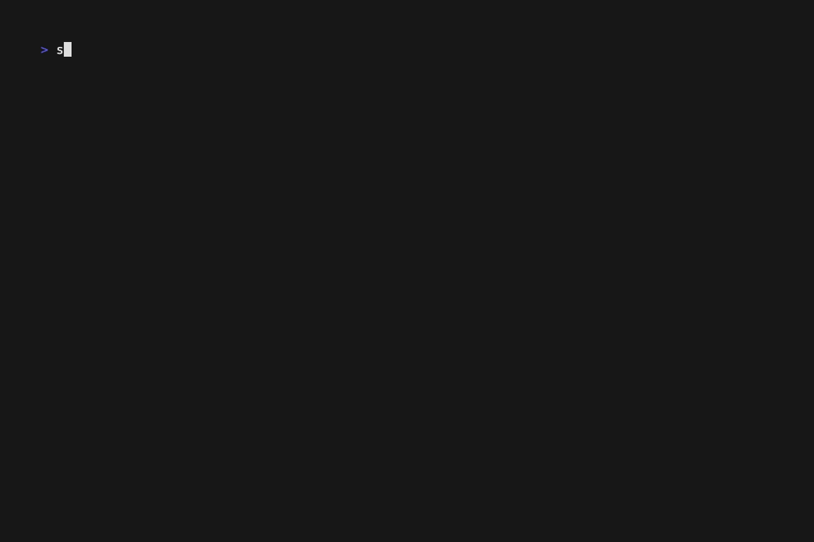
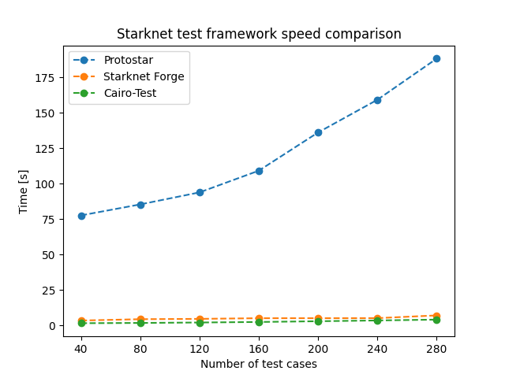

## Starknet Foundry

[![Telegram Chat][tg-badge]][tg-url] [![Telegram Support][tg-support-badge]][tg-support-url]

[tg-badge]: https://img.shields.io/endpoint?color=neon&logo=telegram&label=chat&style=flat-square&url=https%3A%2F%2Ftg.sumanjay.workers.dev%2Fstarknet_foundry

[tg-url]: https://t.me/starknet_foundry

[tg-support-badge]: https://img.shields.io/endpoint?color=neon&logo=telegram&label=support&style=flat-square&url=https%3A%2F%2Ftg.sumanjay.workers.dev%2Fstarknet_foundry_support

[tg-support-url]: https://t.me/starknet_foundry_support


Blazingly fast toolkit for developing Starknet contracts designed & developed by
ex [Protostar](https://github.com/software-mansion/protostar) team from [Software Mansion](https://swmansion.com) based
on native [Cairo](https://github.com/starkware-libs/cairo) test runner
and [Blockifier](https://github.com/starkware-libs/blockifier), written in Rust 🦀.

Need help getting started with Starknet Foundry? Read the
📖 [Starknet Foundry Book](https://foundry-rs.github.io/starknet-foundry/)!



Starknet Foundry, like its [Ethereum counterpart](https://github.com/foundry-rs/foundry), consists of different modules

- [`snforge`](https://github.com/foundry-rs/starknet-foundry/tree/master/crates/forge): Starknet testing
  framework (like Truffle, Hardhat and DappTools but for Starknet).
- [`sncast`](https://github.com/foundry-rs/starknet-foundry/tree/master/crates/sncast): All-in-one tool for
  interacting with Starknet smart contracts, sending transactions and getting chain data.

## Installation

### Linux and MacOS

#### Install Rust >= 1.80.1

```shell
curl --proto '=https' --tlsv1.2 -sSf https://sh.rustup.rs | sh
```

To verify that correct Rust version was installed, run

```shell
rustc --version
```

See [Rust docs](https://doc.rust-lang.org/beta/book/ch01-01-installation.html#installation) for more details.

#### Install ASDF

Follow the instructions from [asdf docs](https://asdf-vm.com/guide/getting-started.html#getting-started).

To verify that ASDF was correctly installed, run

```shell
asdf --version
```

#### Install Scarb

First, add Scarb plugin to ASDF

```shell
asdf plugin add scarb
```

Install Scarb

```shell
asdf install scarb latest
```

To verify that Scarb was correctly installed, run

```shell
scarb --version
```

#### Install Starknet Foundry

First, add Starknet Foundry plugin to ASDF

```shell
asdf plugin add starknet-foundry
```

Install Starknet Foundry

```shell
asdf install starknet-foundry latest
```

To verify that Starknet Foundry was correctly installed, run

```shell
snforge --version
```

or

```shell
sncast --version
```

### Windows

#### Install Rust >= 1.80.1

Go to https://www.rust-lang.org/tools/install and follow the installation instructions.

To verify that correct Rust version was installed, run

```shell
rustc --version
```

See [Rust docs](https://doc.rust-lang.org/beta/book/ch01-01-installation.html#installation) for more details.

#### Install Scarb

1. Download the release archive matching your CPU architecture
   from https://docs.swmansion.com/scarb/download.html#precompiled-packages.
2. Extract it to a location where you would like to have Scarb installed. We recommend `%LOCALAPPDATA%\Programs\scarb`.
3. From this directory, get the full path to `scarb\bin` and add it to PATH.
   See [this article](https://www.architectryan.com/2018/03/17/add-to-the-path-on-windows-10/) for instructions on
   Windows 10 and 11.

To verify that Scarb was correctly installed, run

```shell
scarb --version
```

#### Install Starknet Foundry

1. Download the release archive matching your CPU architecture
   from https://github.com/foundry-rs/starknet-foundry/releases/latest. Look for package with `windows` in the name e.g.
   `starknet-foundry-v0.34.0-x86_64-pc-windows-msvc.zip`.
2. Extract it to a location where you would like to have Starknet Foundry installed. We recommend `%LOCALAPPDATA%\Programs\snfoundry`.
3. From this directory, get the full path to `snfoundry\bin` and add it to PATH.
   See [this article](https://www.architectryan.com/2018/03/17/add-to-the-path-on-windows-10/) for instructions on
   Windows 10 and 11.

To verify that Starknet Foundry was correctly installed, run

```shell
snforge --version
```

or

```shell
sncast --version
```

## Features

- Fast testing framework `snforge` written in Rust
- High-quality dependency management using [scarb](https://github.com/software-mansion/scarb)
- Intuitive interactions and deployment of Starknet contracts through `sncast`

## Roadmap

Starknet Foundry is under active development! Expect a lot of new features to appear soon! 🔥

- [x] Running tests written in Cairo
- [x] Contract interactions testing
- [x] Interacting with Starknet from command line
- [x] Multicall support
- [x] Cheatcodes
- [x] Starknet state forking
- [x] Fuzz testing
- [x] Parallel tests execution
- [x] Performance improvements
- [x] Deployment scripts written in Cairo
- [ ] Transactions profiling 🏗️
- [ ] Debugging utilities 🏗️
- [ ] Test coverage reports (check out [cairo-coverage](https://github.com/software-mansion/cairo-coverage)) 🏗️
- [ ] L1 ↔ L2 messaging and cross-chain testing

## Performance



`snforge` achieves performance comparable to the Cairo Test Runner with improved user experience.

## Getting Help

You haven't found your answer to your question in
the [Starknet Foundry Book](https://foundry-rs.github.io/starknet-foundry/)?

- Join the [Telegram](https://t.me/starknet_foundry_support) group to get help
- Open a [GitHub discussion](https://github.com/foundry-rs/starknet-foundry/discussions) with your question
- Join the [Starknet Discord](https://discord.com/invite/starknet-community)

Found a bug? Open an [issue](https://github.com/foundry-rs/starknet-foundry/issues).

## Contributions

Starknet Foundry is under active development, and we appreciate any help from the community! Want to contribute? Read
the [contribution guidelines](./CONTRIBUTING.md).

Check out [development guide](https://foundry-rs.github.io/starknet-foundry/development/environment-setup.html) for
local environment setup guide.
