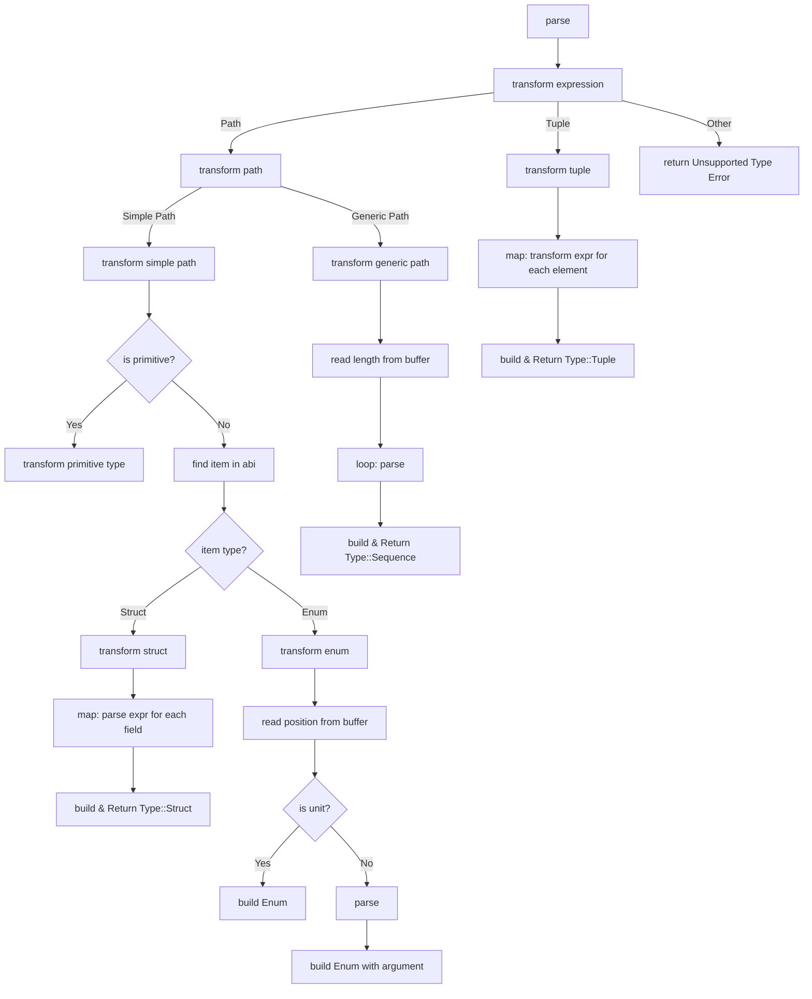

# Reverse Transformer Architecture

## Overview

The Reverse Transformer module provides functionality to interpret `Starknet` smart contract calldata and output data
into a human-readable, Cairo-like source code format. It parses a low-level flat array of Felt values using known ABI
definitions and produces structured string representations of the corresponding values.

This process is called reverse transformation and is primarily handled by parsing expressions representing function
argument types, traversing those types recursively, and reading the correctly typed values from the provided calldata
buffer.

Reverse transformation relies on processing Cairo-style type paths. These paths can be:

- Non-generic paths (simple types such as u32, felt252, starknet::ContractAddress)
- Generic paths (parametrized types such as Array<u8>, Span<felt252>, core::Option<u256>)

The transformer processes these paths by resolving them via ABI metadata into meaningful type definitions, allowing the
data buffer to be decoded according to its declared type signature.

## High-Level Flow

These are the two entry points for this functionality:

- reverse_transform_input
- reverse_transform_output

Both functions extract the parameter types (input or output) of a function in the ABI, then reversely transform the list
of Felt values to their Cairo types.

## Supported Types (Type enum)

| Variant   | Description                                                               |
|-----------|---------------------------------------------------------------------------|
| Primitive | Matches raw Cairo-builtins like u32, i128, felt252, ContractAddress, etc. |
| Struct    | Record-like types with named fields and inner types                       |
| Enum      | Sum types, each variant might carry data                                  |
| Sequence  | Repetitive/counted types like Array, Span                                 |
| Tuple     | Positional group of types                                                 |

All are internally represented and then formatted using their Display implementation.

## Diagram

The following flow best describes the process of parsing and transformation:

