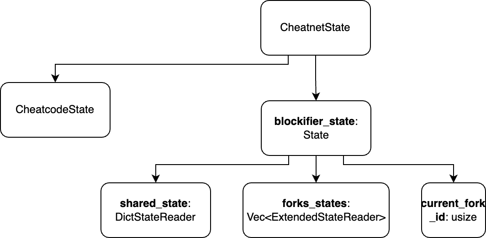

# Multi-forking

Foundry provides a way of interacting with multiple networks inside a single test. We would like to mimic this approach.

## Features

- creating a fork
- selecting a fork
- sharing a contract between all forks

Above features will require us to change currently implemented `CheatnetState`.

## New CheatnetState interface

The most important part (from multi-forking perspective) is one under the `blockifier_state` branch.
We have to keep:
- `shared_state` - which is a common `DictStateReader`. It represents contracts/classes/data shared between all networks (forks).
- `forks_states` - (tmp name) vector keeping track of all forks. Each fork is represented as a `ExtendedStateReader`
which consists of `DictStateReader` and `ForkStateReader`. 
- `current_fork_id` - variable defining which fork is currently in use.

`blockifier_state` is currently represented as a `CachedState<ExtendedStateReader>` because some blockifier methods 
(like AccountTransaction.execute) requires `CachedState`.
`CachedState` is native blockifier struct, so we can't change its implementation to meet our requirements.

It appears that since our tests are contracts we can abandon `CachedState` and `AccountTransaction.execute`.
We would have to verify this idea, but if it is double we could create some class that implements `State` trait from blockifier
and keep it as a `blockifier_state`.

## Interacting with multiple forks (Cheatnet side)

Let's split common fork interaction into parts:

- user creates and selects fork
  - fork is created, saved to `forks_states` and `current_fork_id` is set to 0
- deploys contract `A` and marks it as `shared`
  - contract is deployed
  - all its data is saved under the `shared_state` (address, class_hash and storage)
- deploys contract `B`
  - contract is deployed and saved under the local fork state (`forks_states[current_fork_id]`)
- creates and selects another fork
  - all contracts under the `shared_state` are available for this network
  - `A` is available
  - `B` is not

The most tricky part would be playing on top of the merged `shared_state` with one of the `forks_states`. We can do it
by simply implementing `StateReader` for the `StateCache`. It would search for a contract in the following order:

- check if contract is available in the `shared_state` - if so return it
- check if contract is available in the local `DictStateReader` of the `ExtendedStateReader` - if so return it
- check if contract is available in the forked network (perform call to node) - if so return it
- throw an error

## Required actions

- verify if it is possible to get rid of methods using `CachedState`
- create `StarknetState` (name can be changed) struct which will implement `State` trait
- change `CheatnetState` fields to implement proposed solution
- add control cheatcodes
