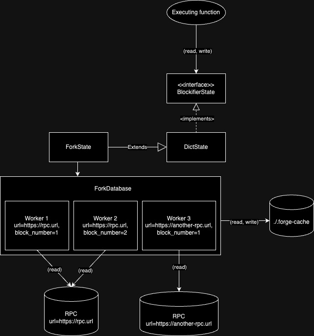
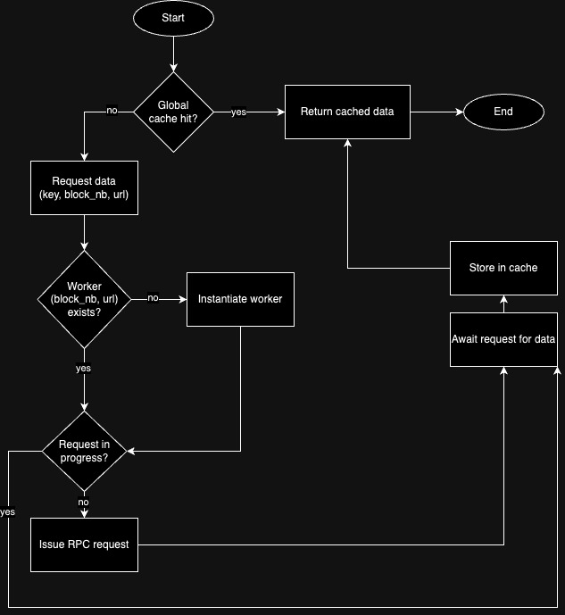

## Motivation

Many projects may rely on state which already exists on the chain. 
This might be difficult to replicate on a local testing environment 
(this might include deploying multiple contracts, performing many transactions etc.).
In order to make this easier, some frameworks from ethereum (like foundry) introduce "state forking" (see [foundry docs](https://book.getfoundry.sh/forge/fork-testing)).

## State forking in foundry

Original implementation allows for 2 ways of forking the state.

Both of the approaches require the user to specify the source (RPC endpoint) and optionally - a block number we want to fork state from.

### 1. Forking the state once for all tests
This is a simpler way of forking, which requires only to pass some arguments to the forge CLI, 
and state is forked for the whole suite.

### 2. Switching forks dynamically in tests, using cheatcodes
Effectively, the state in tests will be switched after creating and selecting the fork. 
This allows a per-case configuration which is more flexible and allows for writing more specific tests.
This also enables testing more advanced scenarios like testing RPC adapters, cross-chain swaps etc. 

## Considered solutions

For the state to be considered as "forked", we have to swap the storage object 
to a one which reads/writes on data from the fork. This can be done in two ways:

- Pulling the state from the fork eagerly (use a fork DB dump as storage, clone and use it for reading & writing)
- Pulling the state from the fork lazily (read from fork on read request, cache locally, write state diffs to local cache)

The latter is preferred as the first is too heavy, inconsistent between node implementations, and generally 
unfeasible for fast testing.

## Architecture

All things considered it's worth to implement the data fetching mechanism properly from the get-go, 
since it's going to be usable in both forking approaches.

### State-forking architecture



### Reading data from the fork




## Next steps

In order to make things simple and easy to review, we should approach implementing this iteratively, 
while considering future expansion. 

### MVP
1. Implement fetching data (contracts, state, classes) utilizing a single worker utilizing `ForkDatabase` architecture
2. Implement executing transaction on top of the forked state (should be able to modify the local state only)
3. Implement user interface, enabling the forking in the tests

### Further down the line
4. Implement storing worker cache on disk, loading and clearing it
5. Implement multifork, fetching utilizing multiple workers + controlling cheatcodes

#### `setup_fork` Cheatcode
`setup_fork` cheatcode allows to create fork inside a test. In the first version, it will be possible to create one fork per test. To simplify keeps vars like fork_url in separate place, is possible to use envs instead of using url.

```cairo
#[derive(Drop)]
enum Block {
    Last: (),
    BlockId: felt252,

}

struct ForkConfig {
   url: felt252,
   block: Block,
   ...
}

trait ContractClassTrait {
    fn set_up(self: @ForkConfig) -> ForkConfig;
}
```

this version allows easily adding new attributes

or

```
#[derive(Drop)]
enum Block {
    Last: (),
    Number: felt252,
}

fn setup_fork(url: ByteArray, block: Block) -> ? {
    ...
}
```

#### Set globally
To set up fork globally add config to toml file.


#### Example Usage