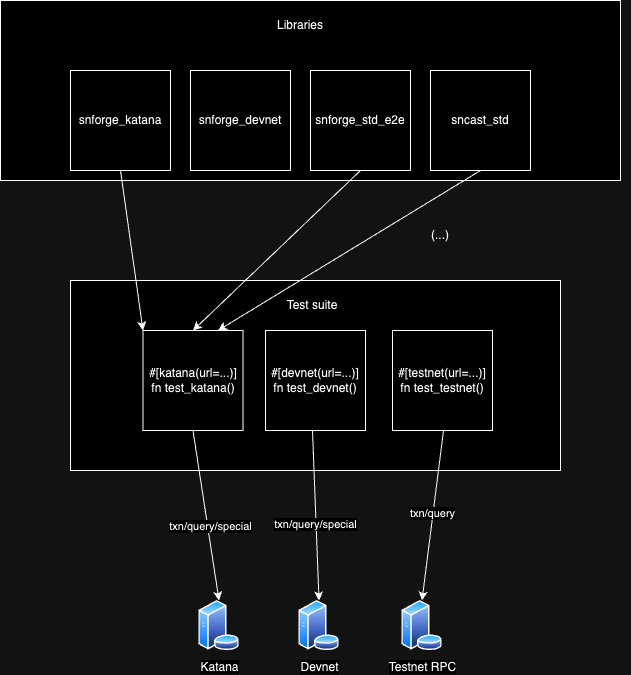

# Transactional testing proposal

## Context

Some flows are not currently intuitively testable via standard testing methods, 
like accounts logic (__validate__, __execute__ etc.), transaction rejections,
fees, contract upgrade flows, and other e2e testing procedures.

## Goal

In order to facilitate that, we should consider adding a way to test
the contracts in conditions as close to real networks conditions as possible.

Also, the goal is to make the deployments testable and validation 
of the deployments possible to the user. 

The tests should be also runnable in a variety of environments, depending on the
use case (namely katana, devnet, or testnet). This would increase user's confidence
in the release process.

## Proposed solution

We could consider extending `cast script`, since the functionalities would overlap.
This could be considered as a variant of `cast script`, in a way. 

The extending/differentiating factors would be:

- Extra environment-specific functions (for [katana](https://book.dojoengine.org/toolchain/katana/reference.html#custom-methods)/[devnet](https://0xspaceshard.github.io/starknet-devnet/docs/dump-load-restart) - see docs)
- Additional RPC functions support (receipts, etc.)
- Test-like behavior (fail/pass)
- Idempotent functions, for functionalities that can fail when double-running them (i.e. declare)


## Solution architecture

### High-level architecture
This is pretty straightforward. We ought to use the existing architecture for hint interception,
provide extra functionality via libraries (one for katana, second one for devnet, possibly more), and collect the cases from
folders using existing collecting logic. 

Note: Currently, the backend architecture between `cast script` and `forge test` is not common,
and the following effort to implement this architecture should be preceded by making that solution.



### E2E tests and scarb

The relation between scarb and the following tests is very much like in `cast script`:
1. Scarb compiles the contracts
2. The test scripts are compiled with foundry (until a plugin solution is available)
3. The test uses artifacts from Ad. 1, runs program from Ad 2. on own VM with hint processing logic 

### File organization within scarb workspace

Each package can have its own contract, so each package could have its own e2e directory, 
and the whole workspace could have it as well (to test it in integration).
For example:
```
project/
├── Scarb.toml
├── e2e/
│   ├── test_integration.cairo
│   └── test_integration2.cairo
├── pkg1/
│   ├── src
│   ├── test
│   └── e2e/
│       └── test_contract_1.cairo
├── pkg2
└── ...
```
## Solution analysis

### Pros

- Support of external tech (devnet, katana) via specialized libraries
- Flow close to real starknet transactions, fees, testing how the protocol changes affect contracts
- Ability to test accounts (__validate__, __execute__)
- Ability to test real deployment/interaction scripts in environment close to real one

### Cons
- Keeping up the specialized libraries updated as tech adds new features/changes
- Overall higher maintenance cost
- Test execution speed significantly lower (depending on the used endpoints' throughput)
- Dry-run mode from sncast scripts might be sufficient for some use cases (testing deployments)
- Might be confusing to users if not communicated correctly


## Usage examples
1. Test transaction signing
```rust
from xxx_std import {deploy_account, deploy_contracts, end_txn, call, stark_curve, Transaction, TransactionStatus, Calldata, Call};  
from xxx_devnet_extras import {set_time, dump};

const PREFUNDED_ADDRESS = 0x31231; // Set by the user, or generated inside the test

#[devnet_test(url=localhost:3000)]
fn test_signature_validation() {
    let account_contract = deploy_account("OZAccount", PREFUNDED_ADDRESS, );
    let mock_contract = deploy_contract("MockContract"); // The one that account is calling

    let txn = Transaction(
        version=2,      // Different versions could be supported
        address=account_contract.address,
        function="__execute__", 
        calldata=Calldata::from_calls(array![Call(...), Call(...)])),
        max_fee=100000,
    );
    
    let signed_txn = stark_curve::sign(txn); // This would also be pluggable, for users to be able to sign with different curves
    
    set_time(123); // Set time for txn
    let result = send_txn(signed_txn); // Synchronous
    match result {
        TransactionStatus::Rejected(data) => { /* assert failure data or gas */ },
        TransactionStatus::Accepted(data) => { /* assert result data  or gas */ }
    };
    
    let account_balance = call(
        address=mock_contract.address, 
        function="get_balance",
        calldata=Calldata::from_calls(array![Call(...), Call(...)])
    );
    
    assert(account_balance > ..., "not correct balance");
    dump(); // Dump can be used for pre-populating your test environment
}
```

## Alternative approaches

### 1. Extending the deployment scripts

We could extend the concept of deployment scripts, adding more contextual info for deployment scripts and providing 
the additional functions could work, but we would lack test-like behavior (pass/fail), and it could also be confusing
from the point of user to use the deployment scripts in that way.


### 2. Providing utilities to emulate transactional testing

It's similar to alternative 1, but rather than integrating those concepts into deployment scripts,
we could implement them into snforge itself.
This approach would include trying to include this kind of flow into the current tests.
We could provide utilities to test validation + execution in accounts, and/or add more cheatcodes which you'd use in the 
said scenarios only (submit_txn, call, etc.). This would make for more confusing flow, if not used correctly
(lack of intuitive separation of concerns for std funcs).


### 3. Providing extra library to a language instead for running those kinds of tests
Let's say we do it in python:
We could develop a library which does all that, with python + starknet.py
Pros: 
- Running arbitrary code is easy
- RPC methods already supported in starknet.py (less work to be done)
Cons:
- Inconsistent codebase (have to include python tooling setup for tests)
- No existing runner re-using (would have to integrate with pytest or something like that)

## Scope for MVP

- Basic test runner with collecting + workspaces support
- Tests can interact with devnet via extra functions (i.e. `devnet_extras` library)
- Tests are runnable on testnet/integration as well
- We are able to run tests with fees and whole transaction flow (handling __validation__ failures, testing __execute__)

## Next steps

- Katana support
- Predeployed accounts
- "Verify" mode (run test on devnet, and then ignore special calls and run it on testnet)
- Forking devnet/katana
- Transaction-based profiling
