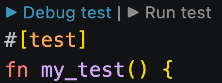

# Debugging

When a contract call fails, the error message alone may not always provide enough information to identify the root cause
of the issue. To aid in debugging, `snforge` offers the following features:

- [live debugging](debugging.md#live-debugging)
- [trace](debugging.md#trace)
- [backtrace](debugging.md#backtrace)


## Live Debugging

The `--launch-debugger` flag enables step-through, breakpoint-based debugging of a Cairo test. When used, `snforge`
acts as a debug adapter communicating over [Debug Adapter Protocol](https://microsoft.github.io/debug-adapter-protocol/),
enabling an editor/IDE to connect and control the execution of the test.

> 📝 **Note**
>
> `--launch-debugger` requires `--exact` - only a single test can be debugged at a time.

### Prerequisites

Live debugging relies on debug information provided by Scarb. To generate the necessary debug information, you need
to have:

1. [Scarb](https://github.com/software-mansion/scarb) version `2.18.0` or higher
2. `Scarb.toml` file with the following Cairo compiler configuration:

```toml
[profile.dev.cairo]
unstable-add-statements-code-locations-debug-info = true
unstable-add-statements-functions-debug-info = true
add-functions-debug-info = true
skip-optimizations = true
```

### Debugging in VSCode

1. Open your Cairo project in VSCode.
2. Make sure the latest [Cairo extension](https://marketplace.visualstudio.com/items?itemName=starkware.cairo1) is installed.
3. Set breakpoints in your cairo files.
4. Start a debugging session:
   - Use the extension's **▶ Debug Test** code lens (displayed above each test function) to launch the debugger - 
     it will invoke `snforge` with `--launch-debugger` automatically and start a debugging session.
   
     
   
   - Alternatively, create the debug configuration manually in `.vscode/launch.json` file and then start a debugging
     session using **Run and Debug** view. Example content of the `.vscode/launch.json` file:
   ```json
   {
       "version": "0.2.0",
       "configurations": [
           {
               "type": "cairo",
               "request": "launch",
               "name": "my_pkg::tests::my_test debug",
               "program": "snforge test --package my_pkg --launch-debugger --exact my_pkg::tests::my_test",
               "processCwd": "${workspaceFolder}"
           }
       ]
   }
   ```

Check [here](https://code.visualstudio.com/docs/debugtest/debugging) for details on how to interact with the VSCode UI.

### Debugging in another IDE

If you are using another IDE, you need to make sure that your DAP client establishes the connection with snforge's 
debug adapter after it is launched. If you run:

```shell
$ snforge test --exact my_package::my_module::test_name --launch-debugger
```

`snforge` will start a TCP server and print the port it is listening on to stdout in the following format:

```shell
DEBUGGER PORT: 12345
```

Connect your DAP client to `localhost` on that port to begin the debugging session.


## Trace

### Usage

> 📝 Note  
> Currently, the flow of execution trace is only available at the contract level. In future versions, it will also be
> available at the function level.

You can inspect the flow of execution for your tests using the `--trace-verbosity` or `--trace-components`  flags when
running the `snforge test` command. This is useful for understanding how contracts are interacting with each other
during your tests, especially in complex nested scenarios.

### Trace Components

The `--trace-components` flag allows you to specify which components of the trace you want to see. You can choose from:

- `contract-name`: the name of the contract being called
- `entry-point-type`: the type of the entry point being called (e.g., `External`, `L1Handler`, etc.)
- `calldata`: the calldata of the call, transformed for display
- `contract-address`: the address of the contract being called
- `caller-address`: the address of the caller contract
- `call-type`: the type of the call (e.g., `Call`, `Delegate`, etc.)
- `call-result`: the result of the call, transformed for display
- `gas`: estimated L2 gas consumed by the call 

Example usage:

<!-- { "package_name": "debugging" } -->
```shell
$ snforge test --trace-components contract-name call-result call-type
```
<details>
<summary>Output:</summary>

```shell
[test name] debugging_integrationtest::test_trace::test_debugging_trace_success
├─ [selector] execute_calls
│  ├─ [contract name] SimpleContract
│  ├─ [call type] Call
│  ├─ [call result] success: array![RecursiveCall { contract_address: ContractAddress([..]), payload: array![RecursiveCall { contract_address: ContractAddress([..]), payload: array![] }, RecursiveCall { contract_address: ContractAddress([..]), payload: array![] }] }, RecursiveCall { contract_address: ContractAddress([..]), payload: array![] }]
│  ├─ [selector] execute_calls
│  │  ├─ [contract name] SimpleContract
│  │  ├─ [call type] Call
│  │  ├─ [call result] success: array![RecursiveCall { contract_address: ContractAddress([..]), payload: array![] }, RecursiveCall { contract_address: ContractAddress([..]), payload: array![] }]
│  │  ├─ [selector] execute_calls
│  │  │  ├─ [contract name] SimpleContract
│  │  │  ├─ [call type] Call
│  │  │  └─ [call result] success: array![]
│  │  └─ [selector] execute_calls
│  │     ├─ [contract name] SimpleContract
│  │     ├─ [call type] Call
│  │     └─ [call result] success: array![]
│  └─ [selector] execute_calls
│     ├─ [contract name] SimpleContract
│     ├─ [call type] Call
│     └─ [call result] success: array![]
└─ [selector] fail
   ├─ [contract name] SimpleContract
   ├─ [call type] Call
   └─ [call result] panic: (0x1, 0x2, 0x3, 0x4, 0x5)
```
</details>
<br>

### Verbosity Levels

The `--trace-verbosity` flag accepts the following values:

- `minimal`: shows test name, contract name, and selector
- `standard`: includes test name, contract name, selector, calldata, and call result
- `detailed`: displays the entire trace, including internal calls, caller addresses, and panic reasons

Example usage:

<!-- { "package_name": "debugging" } -->
```shell
$ snforge test --trace-verbosity standard
```
<details>
<summary>Output:</summary>

```shell
[test name] debugging_integrationtest::test_trace::test_debugging_trace_success
├─ [selector] execute_calls
│  ├─ [contract name] SimpleContract
│  ├─ [calldata] array![RecursiveCall { contract_address: ContractAddress([..]), payload: array![RecursiveCall { contract_address: ContractAddress([..]), payload: array![] }, RecursiveCall { contract_address: ContractAddress([..]), payload: array![] }] }, RecursiveCall { contract_address: ContractAddress([..]), payload: array![] }]
│  ├─ [call result] success: array![RecursiveCall { contract_address: ContractAddress([..]), payload: array![RecursiveCall { contract_address: ContractAddress([..]), payload: array![] }, RecursiveCall { contract_address: ContractAddress([..]), payload: array![] }] }, RecursiveCall { contract_address: ContractAddress([..]), payload: array![] }]
│  ├─ [selector] execute_calls
│  │  ├─ [contract name] SimpleContract
│  │  ├─ [calldata] array![RecursiveCall { contract_address: ContractAddress([..]), payload: array![] }, RecursiveCall { contract_address: ContractAddress([..]), payload: array![] }]
│  │  ├─ [call result] success: array![RecursiveCall { contract_address: ContractAddress([..]), payload: array![] }, RecursiveCall { contract_address: ContractAddress([..]), payload: array![] }]
│  │  ├─ [selector] execute_calls
│  │  │  ├─ [contract name] SimpleContract
│  │  │  ├─ [calldata] array![]
│  │  │  └─ [call result] success: array![]
│  │  └─ [selector] execute_calls
│  │     ├─ [contract name] SimpleContract
│  │     ├─ [calldata] array![]
│  │     └─ [call result] success: array![]
│  └─ [selector] execute_calls
│     ├─ [contract name] SimpleContract
│     ├─ [calldata] array![]
│     └─ [call result] success: array![]
└─ [selector] fail
   ├─ [contract name] SimpleContract
   ├─ [calldata] array![0x1, 0x2, 0x3, 0x4, 0x5]
   └─ [call result] panic: (0x1, 0x2, 0x3, 0x4, 0x5)
```
</details>
<br>

---

## Trace Output Explained

Here's what each tag in the trace represents:

| Tag                  | Description                                                                                                                                                                      |
|----------------------|----------------------------------------------------------------------------------------------------------------------------------------------------------------------------------|
| `[test name]`        | The path to the test being executed, using the Cairo module structure. Indicates which test case produced this trace.                                                            |
| `[selector]`         | The name of the contract function being called. The structure shows nested calls when one function triggers another.                                                             |
| `[contract name]`    | The name of the contract where the selector (function) was invoked. Helps trace calls across contracts.                                                                          |
| `[entry point type]` | (In detailed view) Type of entry point used: External, Constructor, L1Handler. Useful to differentiate the context in which the call is executed.                                |
| `[calldata]`         | (In standard view and above) The arguments passed into the function call.                                                                                                        |
| `[storage address]`  | (In detailed view) The storage address of the specific contract instance called. Helps identify which deployment is used if you're testing multiple.                             |
| `[caller address]`   | (In detailed view) The address of the account or contract that made this call. Important to identify who triggered the function.                                                 |
| `[call type]`        | (In detailed view) Call, Delegate. Describes how the function is being invoked.                                                                                                  |
| `[call result]`      | (In standard view and above) The return value of the call, success or panic.                                                                                                     |
| `[gas]`              | (In detailed view) L2 gas needed to execute the call. The calculation ignores state changes, calldata and signature lengths, L1 handler payload length and Starknet OS overhead. |


## Backtrace

### Prerequisites

Backtrace feature relies on debug information provided by Scarb. To generate the necessary debug information, you need
to have:

1. [Scarb](https://github.com/software-mansion/scarb) version `2.12.0` or higher
2. `Scarb.toml` file with the following Cairo compiler configuration:

```toml
[profile.dev.cairo]
unstable-add-statements-code-locations-debug-info = true
unstable-add-statements-functions-debug-info = true
panic-backtrace = true
```

> 📝 **Note**
>
> That `unstable-add-statements-code-locations-debug-info = true` and
> `unstable-add-statements-functions-debug-info = true` will slow down the compilation and cause it to use more system
> memory. It will also make the compilation artifacts larger. So it is only recommended to add these flags when you need
> their functionality.

### Usage

If your contract fails and a backtrace can be generated, `snforge` will prompt you to run the operation again with the
`SNFORGE_BACKTRACE=1` environment variable (if it’s not already configured). For example, you may see failure data like
this:


<!-- { "package_name": "backtrace_panic" } -->
```shell
$ snforge test
```
<details>
<summary>Output:</summary>

```shell
Failure data:
    (0x417373657274206661696c6564 ('Assert failed'), 0x454e545259504f494e545f4641494c4544 ('ENTRYPOINT_FAILED'), 0x454e545259504f494e545f4641494c4544 ('ENTRYPOINT_FAILED'))
note: run with `SNFORGE_BACKTRACE=1` environment variable to display a backtrace
```
</details>
<br>


To enable backtrace, simply set the `SNFORGE_BACKTRACE=1` environment variable and rerun the operation.

When enabled, the backtrace will display the call tree of the execution, including the specific line numbers in the
contracts where the errors occurred. Here's an example of what you might see:

<!-- TODO(#2713) -->

<!-- { "ignored": true, "package_name": "backtrace_vm_error" } -->
```shell
$ SNFORGE_BACKTRACE=1 snforge test
```
<details>
<summary>Output:</summary>

```shell
"Failure data:
    (0x417373657274206661696c6564 ('Assert failed'), 0x454e545259504f494e545f4641494c4544 ('ENTRYPOINT_FAILED'), 0x454e545259504f494e545f4641494c4544 ('ENTRYPOINT_FAILED'))
error occurred in contract 'InnerContract'
stack backtrace:
   0: (inlined) core::array::ArrayImpl::append
       at [..]array.cairo:135:9
   1: core::array_inline_macro
       at [..]lib.cairo:364:11
   2: (inlined) core::Felt252PartialEq::eq
       at [..]lib.cairo:231:9
   3: (inlined) backtrace_panic::InnerContract::inner_call
       at [..]traits.cairo:442:10
   4: (inlined) backtrace_panic::InnerContract::InnerContract::inner
       at [..]lib.cairo:40:16
   5: backtrace_panic::InnerContract::__wrapper__InnerContract__inner
       at [..]lib.cairo:35:13

error occurred in contract 'OuterContract'
stack backtrace:
   0: (inlined) backtrace_panic::IInnerContractDispatcherImpl::inner
       at [..]lib.cairo:22:1
   1: (inlined) backtrace_panic::OuterContract::OuterContract::outer
       at [..]lib.cairo:17:13
   2: backtrace_panic::OuterContract::__wrapper__OuterContract__outer
       at [..]lib.cairo:15:9"
```
</details>
<br>

### Advanced Configuration

For the most detailed backtrace information, you can add `skip-optimizations = true` to your `Scarb.toml` (requires Scarb >= 2.14.0).
This skips as much compiler optimizations as possible, keeping the compiled code closer to the original and allowing `snforge` to provide more complete and accurate backtrace information.

```toml
[cairo]
skip-optimizations = true
```

Learn more about this option in the [Scarb documentation](https://docs.swmansion.com/scarb/docs/reference/manifest.html#skip-optimizations).

> ⚠️ **Warning**: Setting `skip-optimizations = true` may result in faster compilation, but **much** slower execution
> of the compiled code. If you need to deploy your contracts on Starknet, you should **never** compile them with this
> field set to `true`.
