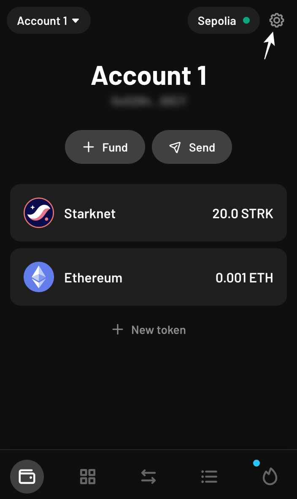
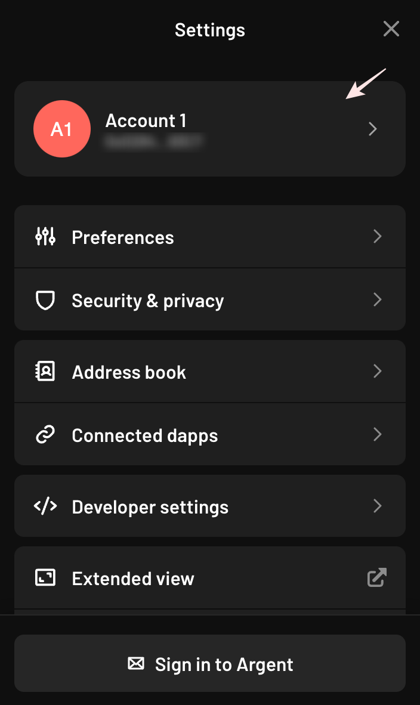
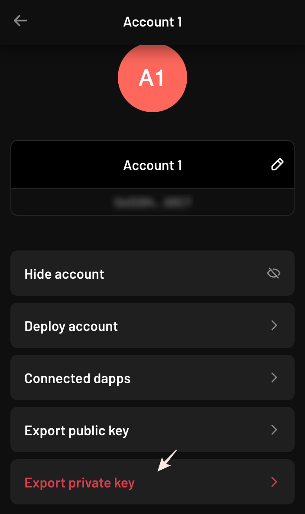
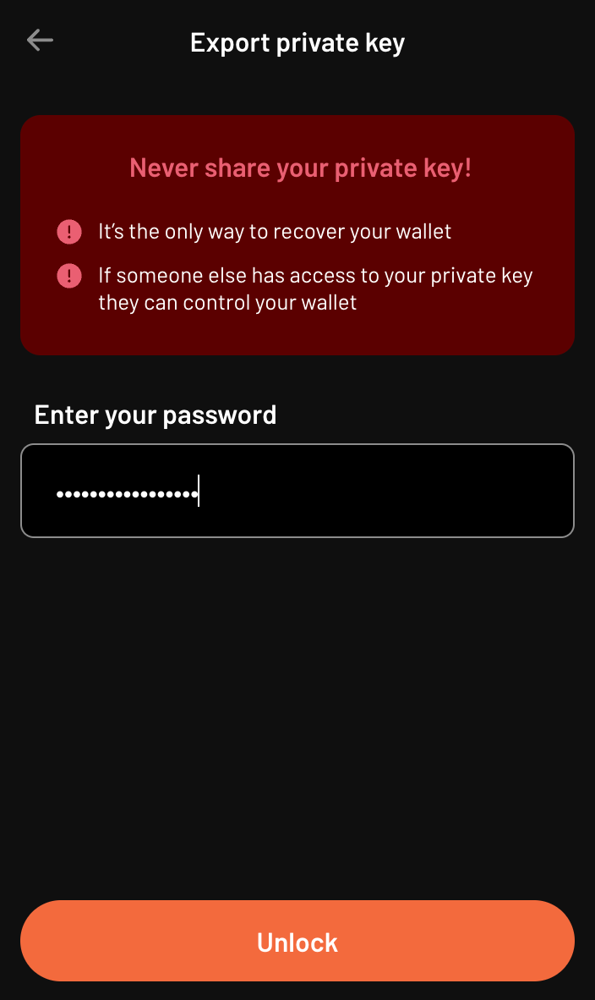
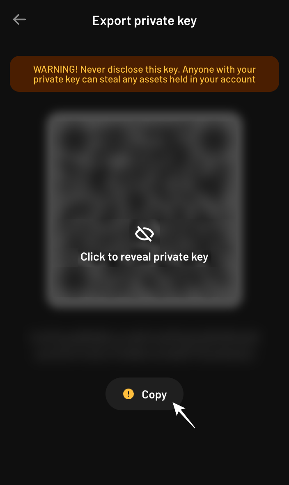
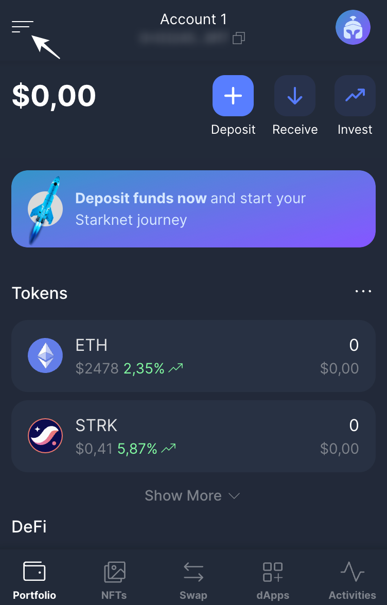
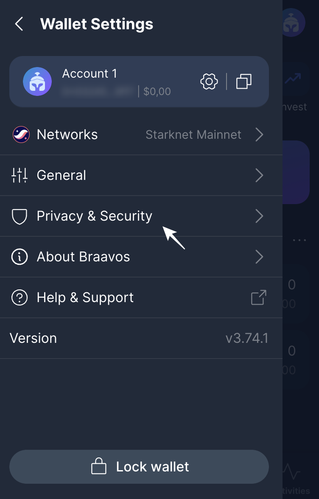
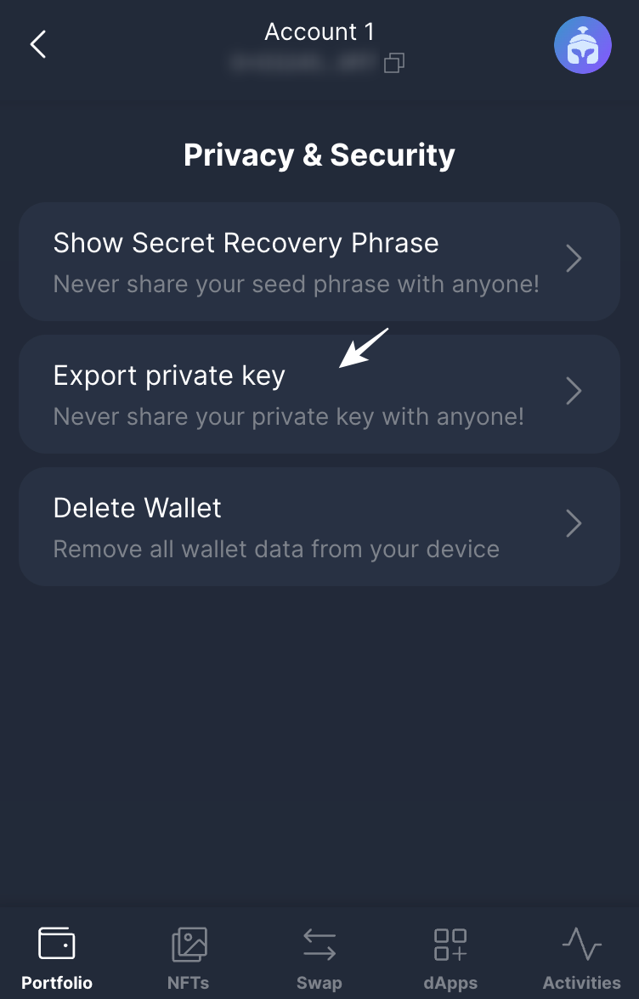
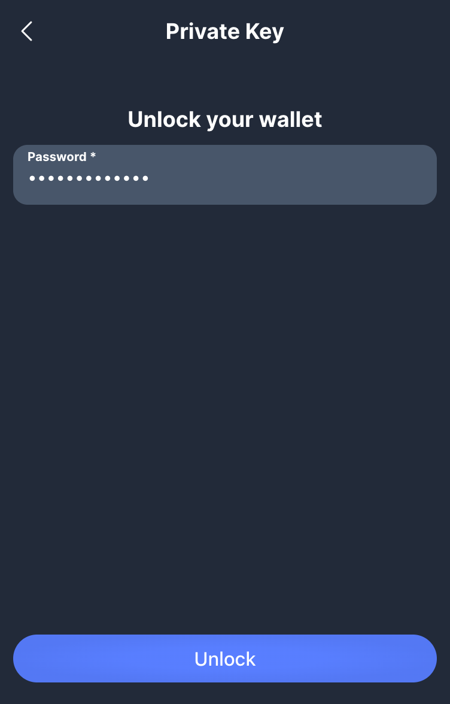
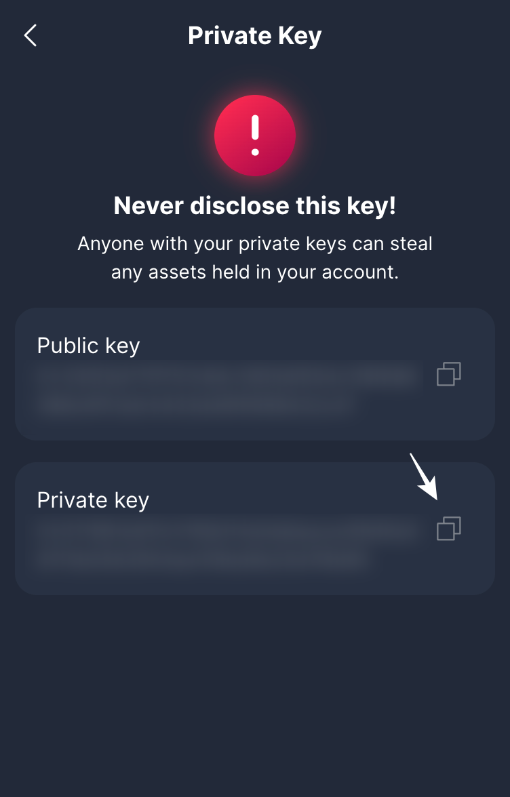

# Importing And Exporting Accounts

You can export your account from wallet (Argent, Braavos) and import it into the file holding the accounts info (`~/.starknet_accounts/starknet_open_zeppelin_accounts.json` by default).

## Exporting an Account

This section shows how to export your private key from wallets.

### Examples

#### Argent

1. Open the Argent app > Settings.
<br/>
<br/>


2. Click on the current account.
<br/>
<br/>


3. Click on "Export private key".
<br/>
<br/>


4. Enter your password.
<br/>
<br/>


5. Copy your private key.
<br/>
<br/>



#### Braavos

1. Open the Braavos app > Wallet settings.
<br/>
<br/>


2. Click on "Privacy & Security".
<br/>
<br/>


3. Click on "Export private key".
<br/>
<br/>


4. Enter your password.
<br/>
<br/>


5. Copy your private key.
<br/>
<br/>


## Importing an Account

### Examples

#### General Example

To import an account into the file holding the accounts info (`~/.starknet_accounts/starknet_open_zeppelin_accounts.json` by default), use the `account import` command.

```shell
$ sncast \
    account import \
	--url http://127.0.0.1:5050 \
    --name my_imported_account \
    --address 0x1 \
    --private-key 0x2 \
    --type oz
```

#### Entering Private Key in Interactive, Obscured Mode

If you don't want to pass the private key as an argument (because of visibility), you can skip `--private-key` flag. You will be prompted to enter the private key in interactive mode.

```shell
$ sncast \
    account import \
	--url http://127.0.0.1:5050 \
    --name my_imported_account \
    --address 0x1 \
    --type oz

Enter private key:
```

#### Argent

To import Argent account, set the `--type` flag to `argent`.

```shell
$ sncast \
    account import \
    ...
    --type argent
```

#### Braavos

To import Braavos account, set the `--type` flag to `braavos`.

```shell
$ sncast \
    account import \
    ...
    --type braavos
```

#### OpenZeppelin

To import OpenZeppelin account, set the `--type` flag to `oz` or  `open_zeppelin`.

```shell
$ sncast \
    account import \
    ...
    --type oz
```