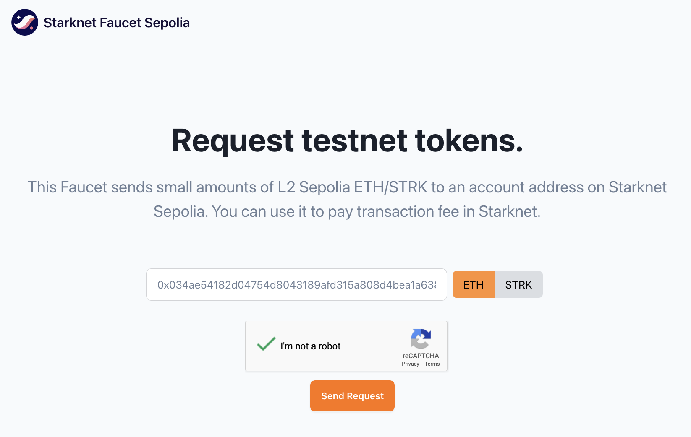

# Creating And Deploying Accounts

Account is required to perform interactions with Starknet (only calls can be done without it). Starknet Foundry `sncast`
supports
entire account management flow with the `sncast account create` and `sncast account deploy` commands.

Difference between those two commands is that the first one creates account information (private key, address and more)
and the second one deploys it to the network. After deployment, account can be used to interact with Starknet.

To remove an account from the accounts file, you can use  `sncast account delete`. Please note this only removes the
account information stored locally - this will not remove the account from Starknet.

> 💡 **Info**
> Accounts creation and deployment is supported for
>  - OpenZeppelin
>  - Argent (with guardian set to 0)
>  - Braavos

## Examples

### Creating an Account

Do the following to start interacting with the Starknet:

#### Create account with the `sncast account create` command

```shell
$ sncast \
    account create \
    --network sepolia \
    --name new_account
```

<details>
<summary>Output:</summary>

```shell
command: account create
address: 0x0[..]
estimated_fee: [..]
message: Account successfully created but it needs to be deployed. The estimated deployment fee is [..]

After prefunding the account, run:
sncast --accounts-file [..]accounts.json account deploy --url [..] --name new_account

To see account creation details, visit:
account: https://sepolia.starkscan.co/contract/[..]
```

</details>
<br>

For a detailed CLI description, see [account create command reference](../appendix/sncast/account/create.md).

See more advanced use cases below or jump directly to the section [here](#advanced-use-cases).

#### Prefund generated address with tokens

To deploy an account in the next step, you need to prefund it with STRK tokens (read more about them [here](https://docs.starknet.io/architecture-and-concepts/economics-of-starknet/)).
You can do it both by sending tokens from another starknet account or by bridging them
with [StarkGate](https://starkgate.starknet.io/).

> 💡 **Info**
> When deploying on a Sepolia test network, you can also fund your account with artificial tokens via
> the [Starknet Faucet](https://starknet-faucet.vercel.app)
> 

#### Deploy account with the `sncast account deploy` command

<!-- TODO(#2736) -->
<!-- { "ignored": true } -->
```shell
$ sncast \
    account deploy \
    --network sepolia \
	--name new_account
```

<details>
<summary>Output:</summary>

```shell
command: account deploy
transaction_hash: [..]

To see invocation details, visit:
transaction: https://sepolia.starkscan.co/tx/[..]
```

</details>
<br>

For a detailed CLI description, see [account deploy command reference](../appendix/sncast/account/deploy.md).

## Managing Accounts

If you created an account with `sncast account create` it by default it will be saved in
`~/.starknet_accounts/starknet_open_zeppelin_accounts.json` file which we call `default accounts file` in the following
sections.

### [`account import`](../appendix/sncast/account/import.md)

To import an account to the `default accounts file`, use the `account import` command.

```shell
$ sncast \
    account import \
	--network sepolia \
    --name my_imported_account \
    --address 0x3a0bcb72428d8056cc7c2bbe5168ddfc844db2737dda3b4c67ff057691177e1 \
    --private-key 0x2 \
    --type oz
```

### [`account list`](../appendix/sncast/account/list.md)

List all accounts saved in `accounts file`, grouped based on the networks they are defined on.

<!-- TODO(#2736) -->
<!-- { "ignored_output": true } -->
```shell
$ sncast account list
```

<details>
<summary>Output:</summary>

```shell
Available accounts (at [..]):
- new_account:
  network: alpha-sepolia
  public key: [..]
  address: [..]
  salt: [..]
  class hash: [..]
  deployed: false
  legacy: false
  type: OpenZeppelin

- my_account:
  network: alpha-sepolia
  public key: 0x48234b9bc6c1e749f4b908d310d8c53dae6564110b05ccf79016dca8ce7dfac
  address: 0x6f4621e7ad43707b3f69f9df49425c3d94fdc5ab2e444bfa0e7e4edeff7992d
  deployed: true
  type: OpenZeppelin
```

</details>
<br>

You can specify a custom location for the accounts file with the `--accounts-file` or `-f` flag.
There is also possibility to show private keys with the `--display-private-keys` or `-p` flag.

### [`account delete`](../appendix/sncast/account/delete.md)

Delete an account from `accounts-file` and its associated Scarb profile. If you pass this command, you will be asked to
confirm the deletion.

```shell
$ sncast account delete \
    --name new_account \
    --network-name alpha-sepolia
```

### Advanced Use Cases

#### Custom Account Contract

By default, `sncast` creates/deploys an account
using [OpenZeppelin's account contract class hash](https://starkscan.co/class/0x05b4b537eaa2399e3aa99c4e2e0208ebd6c71bc1467938cd52c798c601e43564).
It is possible to create an account using custom openzeppelin, argent or braavos contract declared to starknet. This can
be achieved
with `--class-hash` flag:

```shell
$ sncast \
    account create \
    --name new_account_2 \
    --network sepolia \
    --class-hash 0x05b4b537eaa2399e3aa99c4e2e0208ebd6c71bc1467938cd52c798c601e43564
    --type oz
```

#### [`account create`](../appendix/sncast/account/create.md) With Salt Argument

Instead of random generation, salt can be specified with `--salt`.

```shell
$ sncast \
    account create \
    --network sepolia \
    --name another_account_3 \
    --salt 0x1
```

#### Additional features provided with `account import/create`

##### Specifying [`--accounts-file`](../appendix/sncast/account/create.md#create)

Account information such as `private_key`, `class_hash`, `address` etc. will be saved to the file specified by
`--accounts-file` argument,
if not provided, the `default accounts file` will be used.

##### Specifying [`--add-profile`](../appendix/sncast/account/create.md#--add-profile-name)

When the `--add-profile` flag is used, the [profile](../projects/configuration.md#defining-profiles-in-snfoundrytoml)
is automatically created for the account.
Simply use the `--profile` argument followed by the account name in subsequent requests.

#### Using Keystore and Starkli Account

Accounts created and deployed with [starkli](https://book.starkli.rs/accounts#accounts) can be used by specifying the [
`--keystore` argument](../appendix/sncast/common.md#--keystore--k-path_to_keystore_file).

> 💡 **Info**
> When passing the `--keystore` argument, `--account` argument must be a path to the starkli account JSON file.

<!-- Snippets is ignored, because typing password for keystore uses interactive mode -->
<!-- { "ignored": true } -->
```shell
$ sncast \
    --keystore keystore.json \
    --account account.json  \
    declare \
	--network sepolia \
    --contract-name my_contract \
```

#### Creating an Account With Starkli-Style Keystore

It is possible to create an openzeppelin account with keystore in a similar
way [starkli](https://book.starkli.rs/accounts#accounts) does.

<!-- Snippets is ignored, because typing password for keystore uses interactive mode -->
<!-- { "ignored": true } -->
```shell
$ sncast \
    --keystore my_key.json \
    --account my_account.json \
    account create \
    --network sepolia
```

The command above will generate a keystore file containing the private key, as well as an account file containing the
openzeppelin account info that can later be used with starkli.
