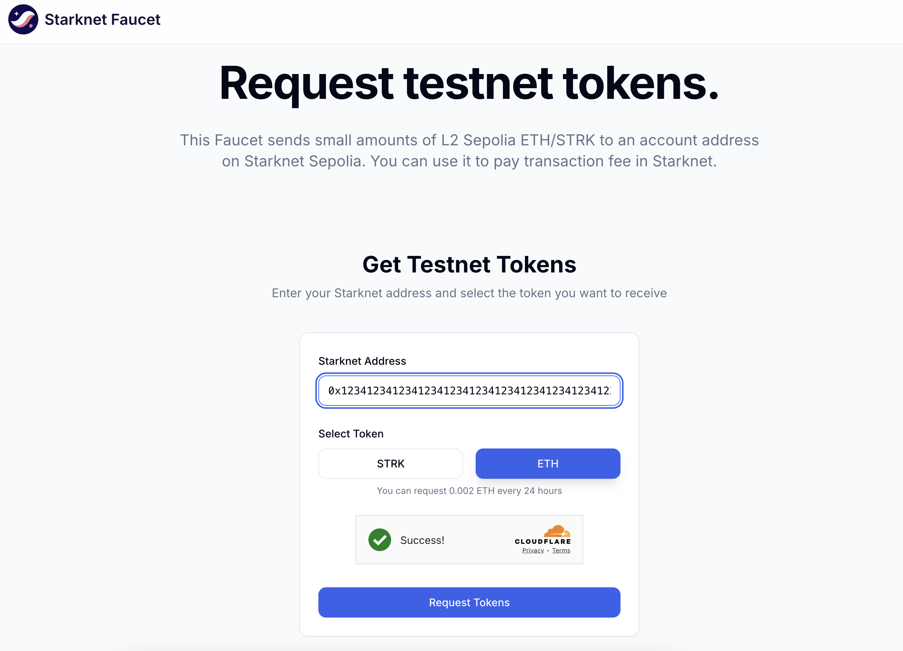

# Creating And Deploying Accounts

Account is required to perform interactions with Starknet (only calls can be done without it). Starknet Foundry `sncast` supports
entire account management flow with the `sncast account create` and `sncast account deploy` commands.

Difference between those two commands is that the first one creates account information (private key, address and more)
and the second one deploys it to the network. After deployment, account can be used to interact with Starknet.

To remove an account from the accounts file, you can use  `sncast account delete`. Please note this only removes the account information stored locally - this will not remove the account from Starknet.

> 💡 **Info**
> Accounts creation and deployment is supported for
>  - OpenZeppelin
>  - Argent (with guardian set to 0)
>  - Braavos

## Examples

### Creating an Account

Do the following to start interacting with the Starknet:

#### Create account with the `sncast account create` command

```shell
$ sncast \
    account create \
    --url http://127.0.0.1:5050 \
    --name some-name
```

<details>
<summary>Output:</summary>

```shell
command: account create
add_profile: --add-profile flag was not set. No profile added to snfoundry.toml
address: 0x34ae54182d04754d8043189afd315a808d4bea1a63862b3b05aa78b37756d7b
max_fee: 180527346330500
message: Account successfully created. Prefund generated address with at least <max_fee> STRK tokens or an equivalent amount of ETH tokens. It is good to send more in the case of higher demand.

To see account creation details, visit:
account: https://starkscan.co/search/contract/34ae54182d04754d8043189afd315a808d4bea1a63862b3b05aa78b37756d7b
```
</details>
<br>

For a detailed CLI description, see [account create command reference](../appendix/sncast/account/create.md).

See more advanced use cases below or jump directly to the section [here](#advanced-use-cases).

#### Prefund generated address with tokens

To deploy an account in the next step, you need to prefund it with either STRK or an equivalent amount of ETH tokens (read more about them [here](https://docs.starknet.io/architecture-and-concepts/economics-of-starknet/)).
You can do it both by sending tokens from another starknet account or by bridging them with [StarkGate](https://starkgate.starknet.io/).

 >💡 **Info**
> When deploying on a Sepolia test network, you can also fund your account with artificial tokens via the [Starknet Faucet](https://starknet-faucet.vercel.app)
>
#### Deploy account with the `sncast account deploy` command

```shell
$ sncast \
    account deploy \
    --url http://127.0.0.1:5050 \
	--name some-name \
	--max-fee 9999999999999
```

<details>
<summary>Output:</summary>

```shell
command: account deploy
transaction_hash: 0x20b20896ce63371ef015d66b4dd89bf18c5510a840b4a85a43a983caa6e2579

To see invocation details, visit:
transaction: https://starkscan.co/search/0x20b20896ce...
```
</details>
<br>

For a detailed CLI description, see [account deploy command reference](../appendix/sncast/account/deploy.md).

> 💡 **Info**
> You can also choose to pay in Ether by setting `--fee-token` to `eth` and specifying transaction version `--version`.

## Managing Accounts

If you created an account with `sncast account create` it by default it will be saved in `~/.starknet_accounts/starknet_open_zeppelin_accounts.json` file which we call `default accounts file` in the following sections.

### [`account import`](../appendix/sncast/account/import.md)

To import an account to the `default accounts file`, use the `account import` command.
```shell
$ sncast \
    account import \
	--url http://127.0.0.1:5050 \
    --name my_imported_account \
    --address 0x3a0bcb72428d8056cc7c2bbe5168ddfc844db2737dda3b4c67ff057691177e1 \
    --private-key 0x2 \
    --type oz
```

### [`account list`](../appendix/sncast/account/list.md)
List all accounts saved in `accounts file`, grouped based on the networks they are defined on.

```shell
$ sncast account list
```

```
Available accounts (at /Users/<username>/.starknet_accounts/starknet_open_zeppelin_accounts.json):
- user0
public key: 0x2f91ed13f8f0f7d39b942c80bfcd3d0967809d99e0cc083606cbe59033d2b39
network: alpha-sepolia
address: 0x4f5f24ceaae64434fa2bc2befd08976b51cf8f6a5d8257f7ec3616f61de263a
type: OpenZeppelin
deployed: false
legacy: false

- user1
[...]
```

You can specify a custom location for the accounts file with the `--accounts-file` or `-f` flag.
There is also possibility to show private keys with the `--display-private-keys` or `-p` flag.

### [`account delete`](../appendix/sncast/account/delete.md)

Delete an account from `accounts-file` and its associated Scarb profile. If you pass this command, you will be asked to confirm the deletion.

```shell
$ sncast account delete \
    --name some-name \
    --network alpha-sepolia
```

### Advanced Use Cases

#### Custom Account Contract

By default, `sncast` creates/deploys an account using [OpenZeppelin's account contract class hash](https://starkscan.co/class/0x00e2eb8f5672af4e6a4e8a8f1b44989685e668489b0a25437733756c5a34a1d6).
It is possible to create an account using custom openzeppelin, argent or braavos contract declared to starknet. This can be achieved
with `--class-hash` flag:

```shell
$ sncast \
    account create \
    --name some-name \
    --url http://127.0.0.1:5050 \
    --class-hash 0x00e2eb8f5672af4e6a4e8a8f1b44989685e668489b0a25437733756c5a34a1d6
    --type oz
```

#### [`account create`](../appendix/sncast/account/create.md) With Salt Argument

Instead of random generation, salt can be specified with `--salt`.

```shell
$ sncast \
    account create \
    --url http://127.0.0.1:5050 \
    --name some-name \
    --salt 0x1
```

#### Additional features provided with `account import/create`

##### Specifying [`--accounts-file`](../appendix/sncast/account/create.md#create)

Account information such as `private_key`, `class_hash`, `address` etc. will be saved to the file specified by `--accounts-file` argument, 
if not provided, the `default accounts file` will be used.


##### Specifying [`--add-profile`](../appendix/sncast/account/create.md#--add-profile-name)

When the `--add-profile` flag is used, you won't need to include the `--url` or `--accounts-file` parameters 
(the latter being necessary if your account information was stored in a custom file).
Simply use the `--profile` argument followed by the account name in subsequent requests.

#### Using Keystore and Starkli Account

Accounts created and deployed with [starkli](https://book.starkli.rs/accounts#accounts) can be used by specifying the [`--keystore` argument](../appendix/sncast/common.md#--keystore--k-path_to_keystore_file).

> 💡 **Info**
> When passing the `--keystore` argument, `--account` argument must be a path to the starkli account JSON file.

```shell
$ sncast \
    --keystore keystore.json \
    --account account.json  \
    declare \
	--url http://127.0.0.1:5050 \
    --contract-name my_contract
```

#### Creating an Account With Starkli-Style Keystore

It is possible to create an openzeppelin account with keystore in a similar way [starkli](https://book.starkli.rs/accounts#accounts) does.

```shell
$ sncast \
    --keystore my_key.json \
    --account my_account.json \
    account create \
    --url http://127.0.0.1:5050 
```

The command above will generate a keystore file containing the private key, as well as an account file containing the openzeppelin account info that can later be used with starkli.
